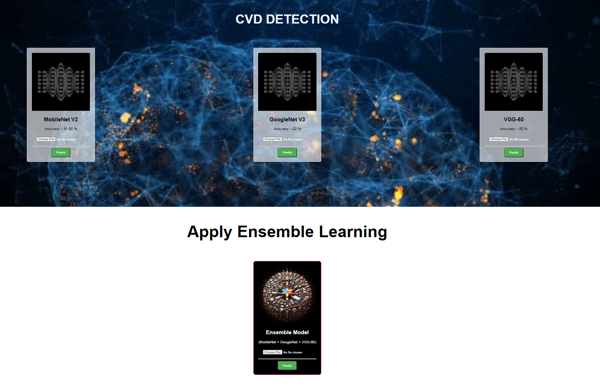

# CVD-Detection

# System architecture

# Front End

## Frontend
The frontend of the CVD Detection project is designed with simplicity and user experience in mind, utilizing basic HTML and CSS. The user interface is intuitive and easy to navigate, allowing users to input necessary health parameters effortlessly. The HTML structure ensures that the form elements are semantically correct, enhancing accessibility. CSS is used to style the application, providing a clean and modern look that improves the overall user experience. The frontend serves as the primary interaction point for users, enabling them to submit their data for cardiovascular disease prediction seamlessly.

## Backend
The backend of the project is powered by Django, a high-level Python web framework that promotes rapid development and clean, pragmatic design. Django handles the server-side operations, managing data received from the frontend and interacting with the machine learning models. It also ensures secure data storage and retrieval, leveraging Django's robust ORM for database management. The backend is responsible for processing user inputs, invoking the ML model for predictions, and returning the results to the frontend. This architecture ensures a smooth and efficient workflow from data submission to result presentation.

## Machine Learning Models
The core of the CVD Detection project lies in its machine learning models, which are trained to predict cardiovascular diseases based on user-provided health data. The models are developed using popular ML libraries and frameworks, such as scikit-learn and TensorFlow. The training process involves preprocessing the dataset, feature selection, and model tuning to achieve high accuracy and reliability. Various algorithms are tested and validated to ensure the best possible performance. The trained models are then integrated into the Django backend, where they are used to analyze new data and provide predictions. This integration ensures that the CVD Detection system remains robust, accurate, and capable of delivering timely health insights to users.
